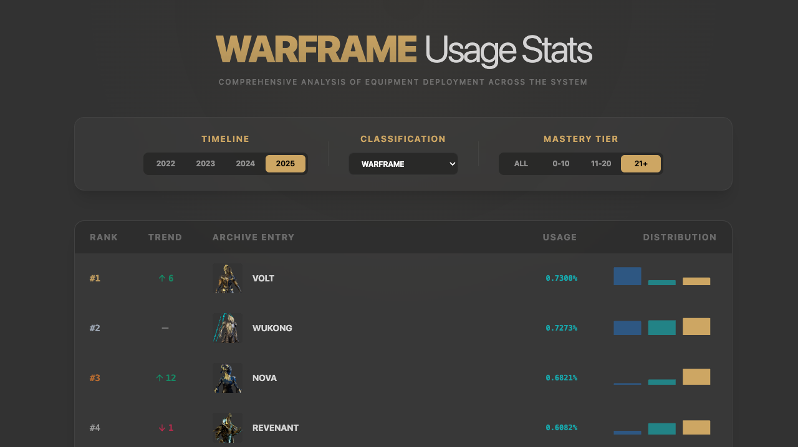

# Warframe Usage Stats

A modern data visualization dashboard for Warframe usage statistics, built with React 19, TypeScript, and Vite 7.

## Screenshot



## Methodology: Mastery Rank Weighted Aggregation

The usage statistics provided by Digital Extremes often break down usage by individual Mastery Rank (MR 0 to 36) alongside a global "ALL" percentage. However, simply summing the percentages for a range (e.g., MR 0-10) is mathematically incorrect as it doesn't account for the relative population size of players at each rank.

This dashboard uses a **Mastery Rank Weighted Aggregation** approach:

1.  **Weight Discovery**: We solved a linear system `global_usage = sum(weight_i * usage_at_mr_i)` across thousands of items to discover the relative population weights `W_0...W_36` of the Warframe player base.
2.  **Range Averaging**: Usage for a range (like "0-10") is calculated as a weighted average: `(sum(usage_i * weight_i)) / sum(weight_i)`.
3.  **Correctness**: This ensures that "0-10" usage reflects the actual popularity of an item *within that specific population tier*, consistent with the global average.

## Methodology: Smart Grouping

For the "Warframe" category, we automatically group base versions with their corresponding Prime and Umbra variants. This provides a more accurate picture of a Warframe's total impact on the meta, as players often transition through variants while maintaining the same playstyle.

## Getting Started

### Prerequisites

- [Bun](https://bun.sh/).

### Installation

```bash
bun install
```

### Development

Start the development server on port 3579:

```bash
bun run dev
```

### Build

Build for production:

```bash
bun run build
```

## Project Structure

- `src/components/`: React components. `PopularityDashboard.tsx` is the main entry point.
- `src/utils/`: Data processing and aggregation logic (`dataLoader.ts`).
- `src/types.ts`: TypeScript interfaces for usage data.
- `scripts/`: TypeScript scripts for data generation and enrichment.
- `public/data/`: JSON data source files (e.g., `WarframeUsageData2025.json`).
- `docs/CODEMAPS/`: Architectural documentation and system maps.

## Utility Scripts

The project includes scripts for data processing, located in the `scripts/` directory. Run them using `tsx`:

```bash
bun scripts/gen_img_url.ts
```

## License

MIT
